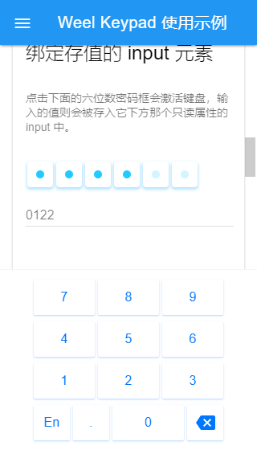
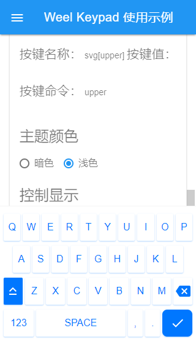

# Weel Keypad [](https://travis-ci.org/wallenweel/weel-keypad)
> 优先移动端浏览器环境使用的虚拟键盘，在开箱即用的基础上支持高度定制化，按需可对所有 DOM 节点进行调整或重写，完全分离结构与样式，布局、展现方式及主题样式交由 CSS 实现。

**master** 分支中 `dist` 目录里的用于 [Demo](http://keypad.weel.xyz/) 的库文件可能不是最新的代码，建议克隆 **develop** 分支后手动构建文件。


## 项目进展状态

pre-Alpha --> Alpha ✔ --> Beta


## 截图预览





## 特性清单

- [x] 数字键盘布局
- [x] 自定义键盘布局
- [x] 通过钩子自定义 Dom 元素
- [x] 明暗两色默认主题
- [x] 分离布局（Layout）与主题样式（Theme）
- [x] 基于选项的配置
- [ ] 添加定制化的工具条
- [x] Flex 方式布局
- [ ] Float 布局选项（Legacy 兼容）
- [x] 响应正常的可编辑元素（input、div[contenteditable]）
- [x] 按需叫出键盘
- [x] 支持桌面端鼠标事件
- [x] 支持 SVG 图片作为按键
- [x] 支持键盘切换


## 下载使用

1. 使用 develop 分支手动构建，或者切换道  master 分支找到`dist/` 目录
2. 下载合适的库文件，浏览器环境建议 `keypad.umd.min.js` （通用模块）
3. 在页面中引入库文件
4. 使用 new 操作符实例化 `new Keypad(options, [, layouts, maps])`，具体演示可访问 [Demo](http://keypad.weel.xyz/) 页面


## 选项

> 实例化所需的所有选项都是可选的，根据需求进行配置即可。

### 配置选项 `options`
```javascript
export const defaultOptions = {
  // 可以响应 “focus|blur” 事件的元素，例如，<input type="text">、<div contenteditable>
  // 支持 selector 字符串，使用 querySelectorAll 查找 DOMs
  el: null, // {HTMLElement|NodeList|String}

  // 接受并存储按键内容的 “input” 元素，只支持单个 DOM 元素
  input: null, // {HTMLElement}

  // 默认 true 使用 Flex 布局，false 使用 Float 布局
  flex: true, // {Boolean}

  // 默认 true 使用 touch 相关事件，false 使用 mouse 相关事件
  mobile: true, // {Boolean}

  // 按键按下时触发回调函数，数组参数： [text, value, code]
  onstart: null, // {Function}

  // 按键放开时触发回调函数，参数同上
  onend: null,  // {Function}

  // true 为载入后立即显示
  show: false, // {Boolean}

  // 默认显示的键盘布局，默认数字键盘，可用值：number, qwer
  name: 'number', // {String}

  // 是否渲染多键盘，false 为只渲染 “name” 指定的键盘
  multiple: true, // {Boolean}

  // 替换程序的渲染方法, 参数：layouts
  render: null, // {Function}

  // 个部分元素渲染时应用钩子，参数：target，this 为当前 Keypad 实例
  // 定义 target 后必须 return target 以继续完整的渲染
  reducer: {
    // {Function}
    wrap: null,
    container: null,
    content: null,
    row: null,
    key: null
  },

  // 替换 kypd-name 的自定义标签，会无效化所有的默认样式
  tag: null, // {Strimg}

  // 自定义主题名称，kypd-<flex|float>wrap[data-kypd-theme=""default]
  theme: 'default', // {String}
  
  // 暗色主题开关，kypd-<flex|float>wrap[data-kypd-dark=""false]
  dark: false, // {Boolean}

  // 使用 appendChild 方法注入键盘的位置，默认为 body
  // 值为 falsy 的话则只渲染不注入到页面中，之后手动调用 keypad.inject()
  inject: document.body // {HTMLElement?}
}
```

### 自定义布局 `layouts`

> 键盘布局使用三维数组实现，可以很直观的创建自由度很高的布局。

#### 说明

1. 第一层为布局容器
2. 第二层为每一行按键的容器
3. 第三层为定义的按键 `[text, [, value, code]]`

#### 使用 SVG

1. 设置 `text` 为形如 `<svg ...><path d="..."></path></svg>` 的 SVG 字符串
2. 通过 `svg[name]` 使用 **[内置的 SVGs](src/images/index.js)**

```javascript
/**
 * 默认的两个布局示例
 */

// 数字键盘
export const number = [
  [[7], [8], [9]],
  [[4], [5], [6]],
  [[1], [2], [3]],
  [['svg[backspace]', null, 'backspace'], [0], ['·', '.']]
]

// 简略版的 QWER 键盘
export const qwer = [
  [['q'], ['w'], ['e'], ['r'], ['t'], ['y'], ['u'], ['i'], ['o'], ['p']],
  [['a'], ['s'], ['d'], ['f'], ['g'], ['h'], ['j'], ['k'], ['l']],
  [['z'], ['x'], ['c'], ['v'], ['b'], ['n'], ['m']],
  [['svg[upper]', null, 'upper'], ['Space', ' '], [','], ['.'], ['svg[backspace]', null, 'backspace']]
]

// 单个普通按键 “0”
[
  '0', // 显示名称
  0, // 按键的值，可选
  null // 按键对应的键码，可选
]
// 等价于，value 值不存在时默认使用 text 名称作为值
['0']

// 单个功能按键
[
  'backspace', // 名称
  null, // 没有值的话使用 null 来忽略
  'backspace' // 自定义键码，程序内置了几个（见 maps 部分），也可自定义设置
]

// 切换到键盘
// @@+键盘布局 name
// 只有 @@ 的话则循环切换下一个
['123', null, '@@number']

```

### 自定义键映射 `maps`

```javascript
// 内置默认的，后续会增加
export const defaultMaps = {
  upper: 'upper', // 大写锁定
  ctrl: 'ctrl',
  alt: 'alt',
  shift: 'shift'
}
```

## 方法 & 属性

```javascript
/** 实例化 */
const kypd = new Keypad({...})

/** 可调用的方法 */
// 显示|隐藏|切换，参数 `name` 同选项 "name"
kypd.show([, name])
kypd.hide([, name])
kypd.toggle([, name])

//手动将键盘注入到页面，参数 `target` 同选项 "inject"
kypd.inject([, target])

// 手动监听 input 元素 focus|blur 事件，参数 `el` 同选项 "el"
kypd.listen([, el])

// 从页面中移除由载 kypd.inject() 入的最后一个
kypd.remove()

// 更新深色主题，参数 status 默认为 truthy，falsy 则关闭深色主题
kypd.dark([, status])

/** 可使用的属性 */
kypd.options // 合并后的选项
kypd.layouts // 合并后的键盘布局
kypd.maps // 合并后的按键映射
kypd.wrap // 包裹键盘内容的根元素
kypd.input // 选项中的 "input" 或者监听后的触发focus 的 input 元素
```


## 构建项目

```bash
#  安装依赖，推荐使用 yarn
yarn

# 或者
npm install

# 启动项目开发环境并监听源文件
npm start

# 开发时打包
npm run bundle

# 发布时打包
npm run build
```